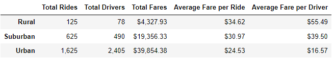
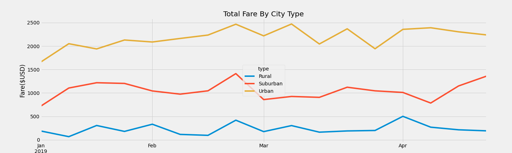

# PyBer_Analysis
Using Matplotlib and Pandas to analyze rideshare data. 

## Overview of the project

In this project analyze rideshare data for PyBer to help improve access to ride-sharing services and determine affordability for underserved neighborhoods. I analyze data from January to early May of 2019. 

I create a summary DataFrame of the ride-sharing data by city type. Then, using Pandas and Matplotlib, I create a multiple-line graph that shows the total weekly fares for each city type. 

## Results

Below is a summary of key metrics that I calculated from the larger dataset to capture disparities in city types.

The summary shows that:

- Urban cities have the highest number of rides and drivers while rural cities. Consequently, the Urban city type saw a higher (seen in the "Total Fares" column. 
-  The "Average Fare per Ride [and Driver]" column shows that Rural city types have the highest average fare per ride. We can infer that the higher fare cost is due to the low number of rides and drivers. 

- In the figure above we can see that rural areas show significantly lower from income from rides compared to the urban cities

## Summary

I set out to analyze the data and provide business recommendations to the CEO of PyBer to address any disparities among the city types.

- Urban cities show the most affordable fares per ride, presumably due to a higher number of drivers. Since the fares are lower, PyBer gets more customers. The urban cities are therefore more affordable to riders and PyBer should continue investing in the space to keep it that way
- Rural city types have the highest average fare per ride. We can infer that the higher fare cost is due to the low number of rides and drivers. It is likely that the higher cost may be a deterrent for riders using PyBer services. The company could work to recruit more drivers using incentives and different marketing strategies to increase driver supply and hopefully reduce the fares per ride. Increased affordability may increase riders and consequently increasing revenue for PyBer. 
- The suburban city type performed in the middle range. Similar strategy suggested above for rural areas could be utilize to increas Pyber usage in urban cities as well. 
